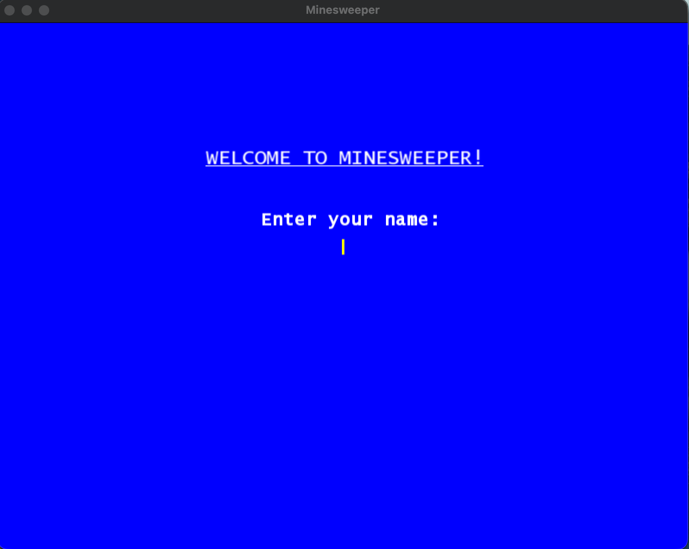
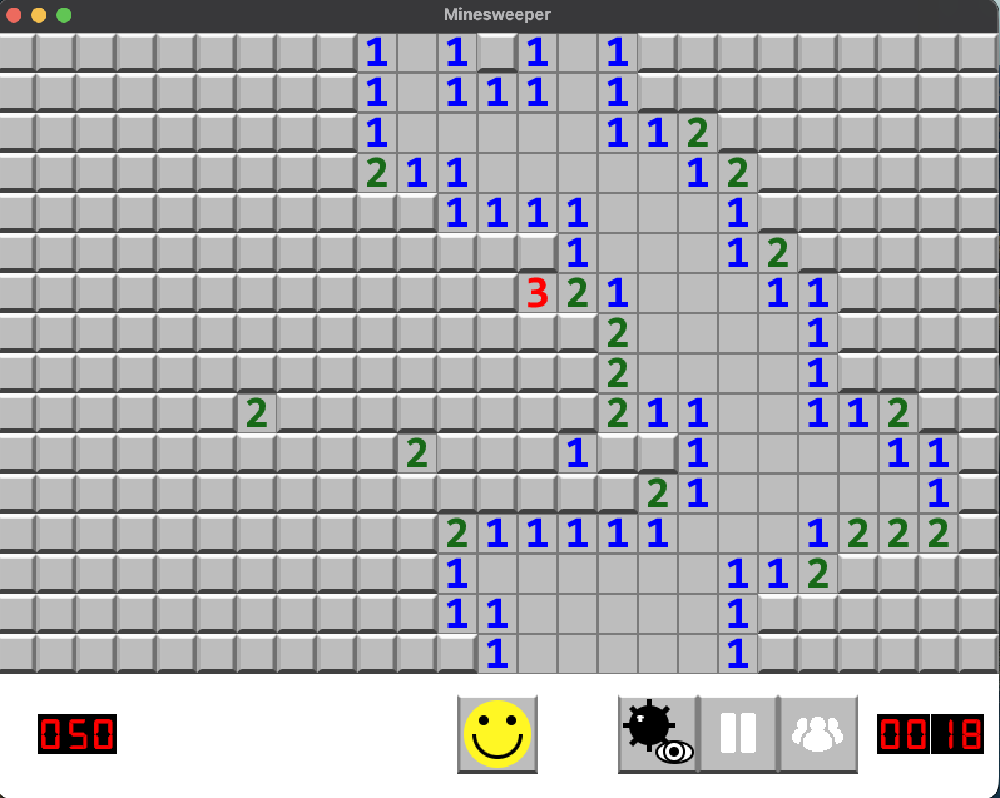
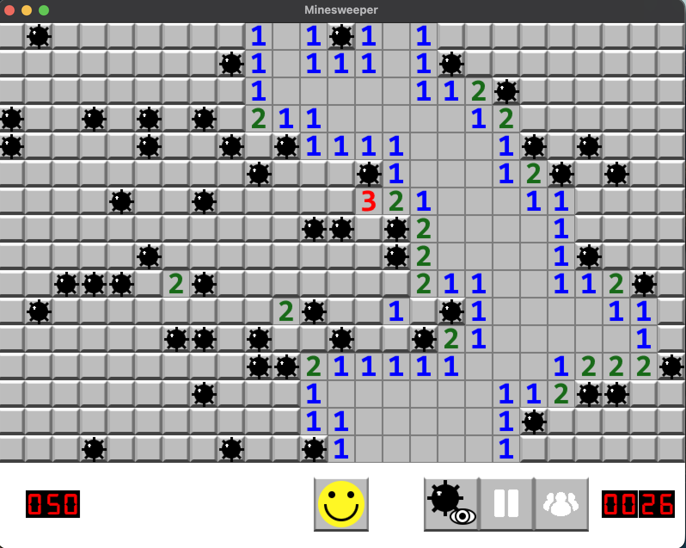
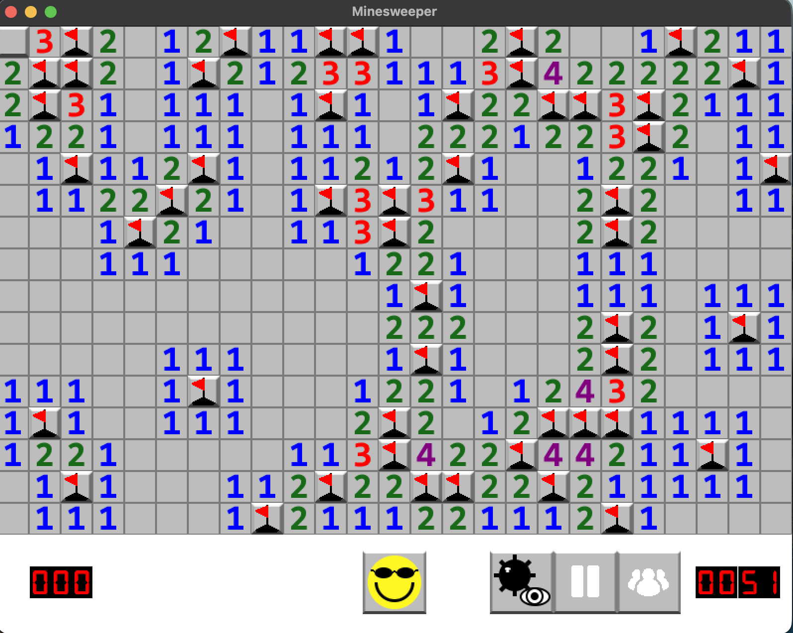
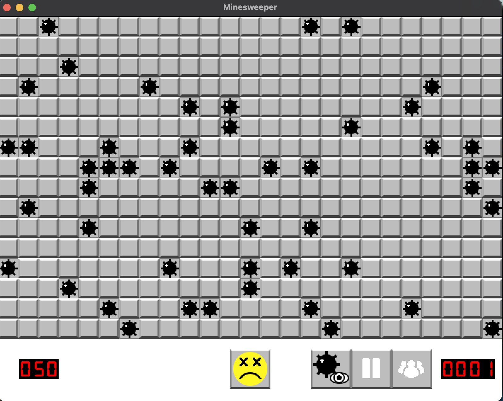
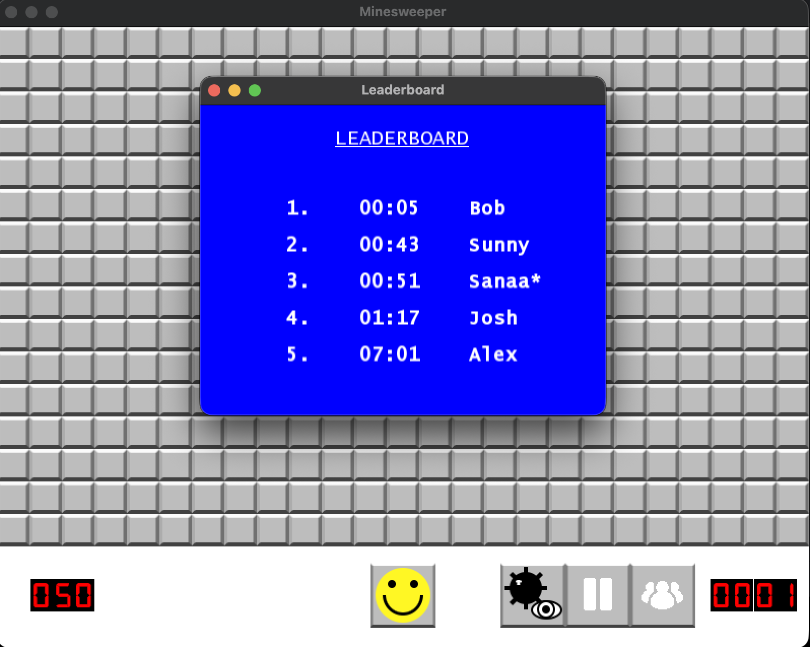

# Minesweeper
---

Minesweeper  built in C++ using [SFML 3.0.2](https://www.sfml-dev.org/). The board size and mine count are fully configurable, scores are saved to a leaderboard, and the game includes a debug mode for revealing mine positions during play.


## Requirements
---

| Requirement | Version |
|-------------|---------|
| C++ standard | C++17 |
| CMake | >= 3.28 |
| SFML | 3.0.2 |
| Compiler | Clang (macOS) or any C++17-compatible compiler |


## Features
---

### Welcome Screen
---

When the game opens, a welcome screen prompts the player to type their name before play begins. Only alphabetic characters are accepted (up to 10 characters max), and the first letter is automatically capitalized. Pressing enter confirms and starts the game.



### The Game Board
---

After entering a name, the main game window appears. The grid of tiles fills the upper portion of the window and the toolbar runs along the bottom.



**Revealing tiles** — left click any hidden tile to reveal it. If the tile has no adjacent mines it shows up blank when revealed, and the game automatically recursively reveals all connected safe tiles until it reaches tiles with adjacent mine counts. A single click on an open area can clear a large section of the board at once.

**Flagging tiles** — right click a hidden tile to place a flag on it, marking it as a suspected mine. Right clicking a flagged tile removes the flag. Flagged tiles are protected and cannot be accidentally revealed by a left click.


### The Toolbar
---

- **Mine counter** — shows `total mines - flags placed` as a 3 digit display. Goes negative if more flags are placed than there are mines.
- **Smiley face / Restart** — click at any time to reset the board with a new random mine layout, reset the timer, and restore all button states. The face changes to reflect the game outcome (win face or lose face) when the game ends.
- **Debug button** — toggles a mode where mine positions are drawn on top of all unrevealed, unflagged tiles without ending the game. Useful for understanding the layout. Toggles back off with another click.
- **Pause / Play button** — pauses and resumes the game. While paused, every tile flips to its covered appearance so the board cannot be studied, and the timer stops. Unpausing restores all tile visuals and resumes the timer.
- **Leaderboard button** — opens the top 5 leaderboard in a separate popup window. The game timer pauses while the popup is open and resumes when it is closed.
- **Timer** — counts elapsed seconds. Starts when gameplay begins and pauses on win, loss, pause, or while the leaderboard is open.


### Debug Mode
---

Clicking the debug button overlays mine icons directly on unrevealed, unflagged mine tiles so the full layout is visible while the game is still in progress. Clicking the button again removes the overlays. This does not affect gameplay in any way — tiles can still be clicked, flagged, and revealed normally while debug mode is on.



### Winning
---

The win condition is triggered the moment every non-mine tile has been revealed. When that happens:

1. The timer stops.
2. All remaining unflagged mines are automatically flagged.
3. The smiley face swaps to the sunglasses win face.
4. The player's finishing time is written into `files/leaderboard.txt` and the leaderboard popup opens immediately.




### Losing
---

The lose condition fires the moment a mine tile is revealed by a left-click:

1. The timer stops.
2. All mines across the entire board are revealed simultaneously.
3. The smiley face swaps to the dead/lose face.
4. No further tile clicks are registered, only the restart button remains functional.



### Leaderboard
---

The leaderboard tracks the top 5 fastest winning times and persists them between sessions in `files/leaderboard.txt`. Each entry stores the time  alongside the player's name. On a win, the new time is inserted, all entries are sorted, only the top 5 are kept, and the file is rewritten. The current session's entry is marked with an asterisk (`*`) so it stands out in the list.

The leaderboard can be opened at any point during play using the toolbar button — the timer pauses while it is open. It also opens automatically the moment a game is won.




## Controls Reference
---

| Action | Input |
|--------|-------|
| Reveal tile | Left-click |
| Flag / unflag tile | Right-click |
| Restart game | Click the smiley face button |
| Toggle debug mode | Click the debug button |
| Pause / Resume | Click the pause/play button |
| View leaderboard | Click the leaderboard button |
| Quit | Close the window |


## Building & Running

SFML is downloaded and compiled automatically — no manual installation needed.

```bash
# Configure and build from the project root
cmake -B cmake-build-debug
cmake --build cmake-build-debug
```

The game reads all assets and data files relative to the working directory, so launch the binary from `cmake-build-debug/`:

```bash
cd cmake-build-debug
./Minesweeper
```

---

## Configuration

Before the game starts, it reads `files/config.cfg` to determine board dimensions and difficulty. Each value sits on its own line:

```
25   # number of columns
16   # number of rows
50   # number of mines
```

The window is automatically sized to fit: `width = columns x 32 px`, `height = (rows x 32) + 100 px`. The extra 100 px at the bottom is the toolbar that holds the mine counter, buttons, and timer. Changing the config takes effect on the next launch.

---
